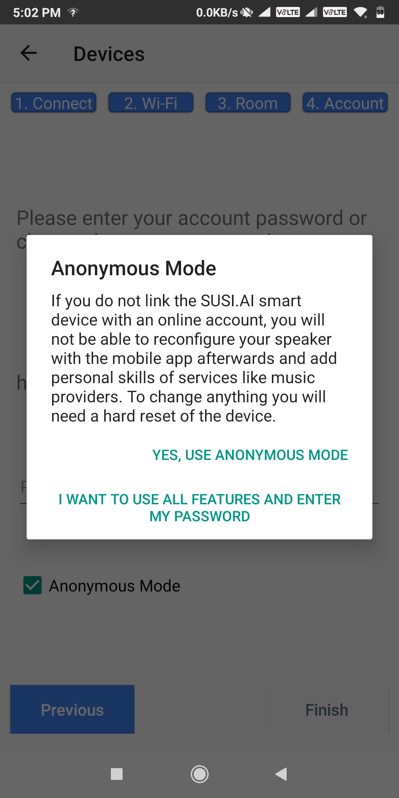
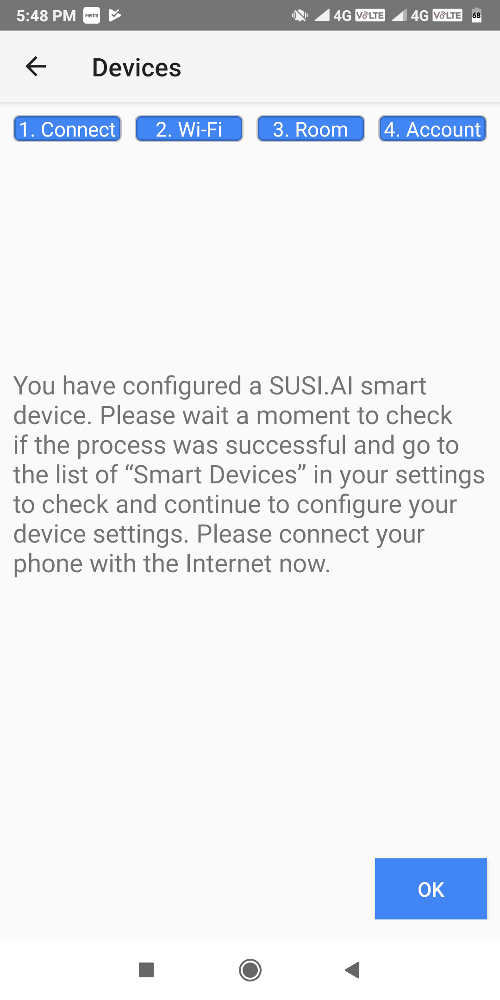

# Smart Speaker Configuration Guide

Make sure your device either has the latest SUSI Smart Speaker Image or you ran the install.sh from susi_installer on your device prior to this guide.

This guide is for setting up the smart speaker using the SUSI android app.

## Configuring the smart speaker using the Android app

* Download the Android app either from the [playstore](https://play.google.com/store/apps/details?id=ai.susi) or from [Github](https://github.com/fossasia/susi_android/tree/apk).

* Open up the android app to see a screen like this. Login to your account or register a new one as per your need.

   

* After logging in you'll see the main screen of the app. click on the blue circle icon with SUSI logo on it.

   

* Now You'll see the SUSI skills page, click on the three dots on the top right corner of the screen and select settings.

   

* Scroll Down to the devices section. And click on `Connect new device`.

   
  
* To start the configuration process, plug in your SUSI.AI smart device and wait for the “Ping” sound. The SUSI.AI device will 
  automatically open a Wi-Fi hotspot. Please connect your phone to the wireless network with the SSID “SUSI.AI” and password as "password".
  When you are successfully connected to the "SUSI.AI" wifi, press "Connected to SUSI.AI" button.

  
 
* Now, choose the home network from the list shown to which you want to connect your smart speaker.
 
  
 
* Now, enter the password for the network you selected and then press "NEXT" button. If, the network you choose is open,
  then no need of entering anything in the password field, just press "NEXT" button.
  
   
  
* The next step is to choose the room where you want to keep the smart speaker. To, do so just click on the room name and then press "NEXT" button. You can also
  add or delete new rooms by pressing the respective buttons.
  
  <table>
    <tr>
      <td></td>
      <td></td>
      <td></td>
    </tr>
  </table> 
  
* In the last step you need to choose wether you want to use your device in anonymous mode or not. If you choose anonymous mode, then you want be able to 
  reconfigure your device. If you want to use non anonymous mode, just enter the password of your susi account and press finish button. To continue in anonymous
  mode click the "Anonymous Mode" checkbox, and then choose "YES, USE ANONYMOUS MODE".
  
  <table>
    <tr>
      <td></td>
      <td></td>
      <td></td>
    </tr>
  </table>  
  
* Press "YES, FINISH SETUP", to complete your device setup else press "GO BACK" if you want ot change any configuration. 
  
   
   
* At the last press "OK" after the confirmation message of device setup appears.
  
      

#### The speaker should now reboot. If everything is set-up correctly, you'll hear "SUSI has started" sound and the three LED lights on the Respeaker Pi-Hat will light up.
