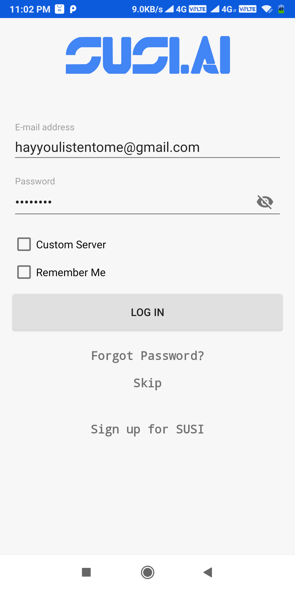
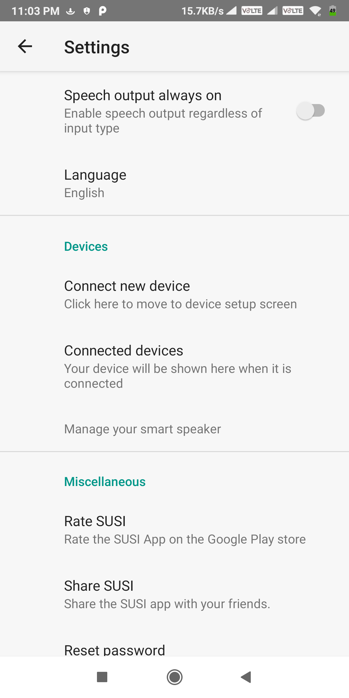
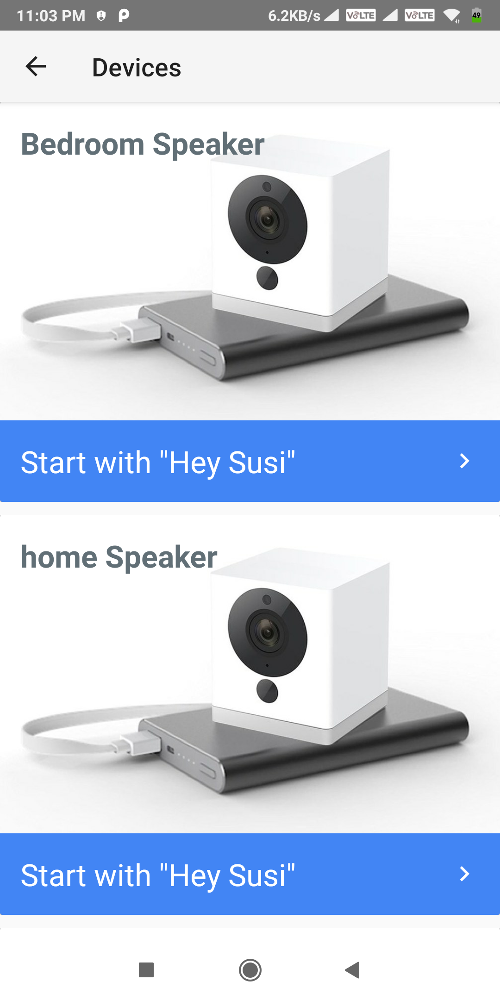
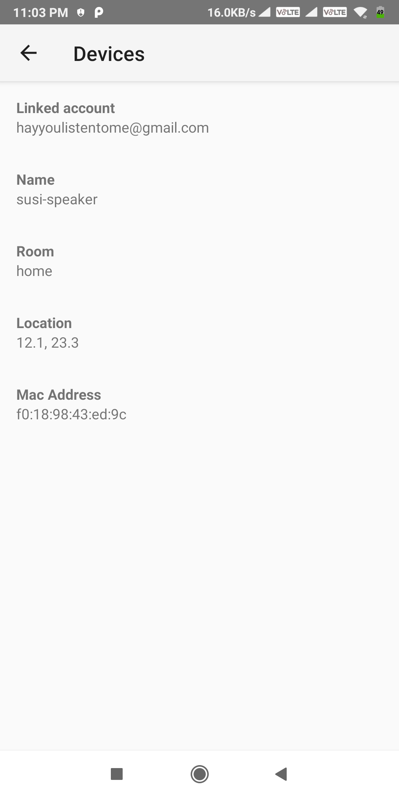
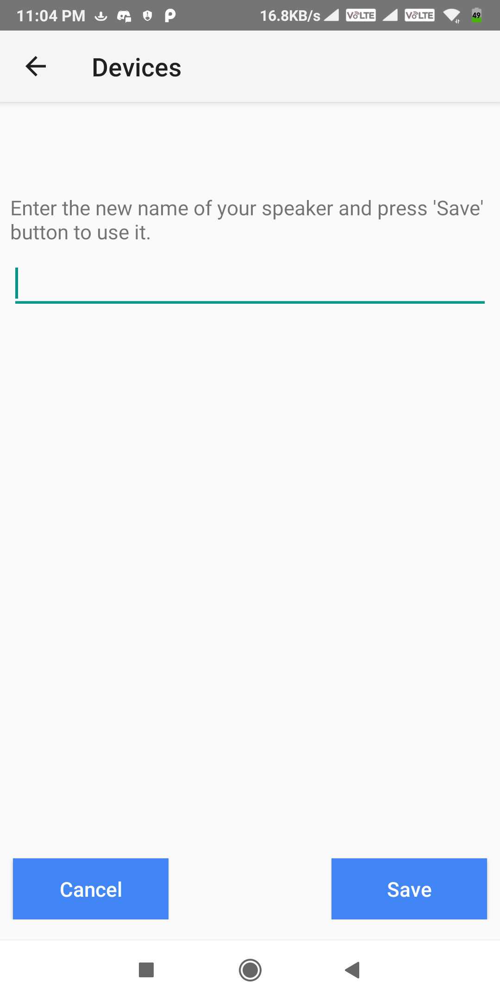
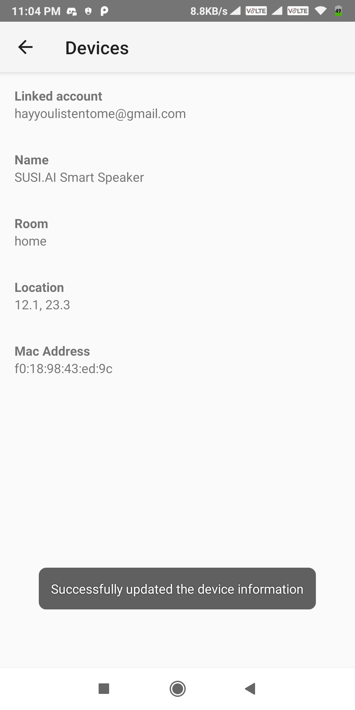
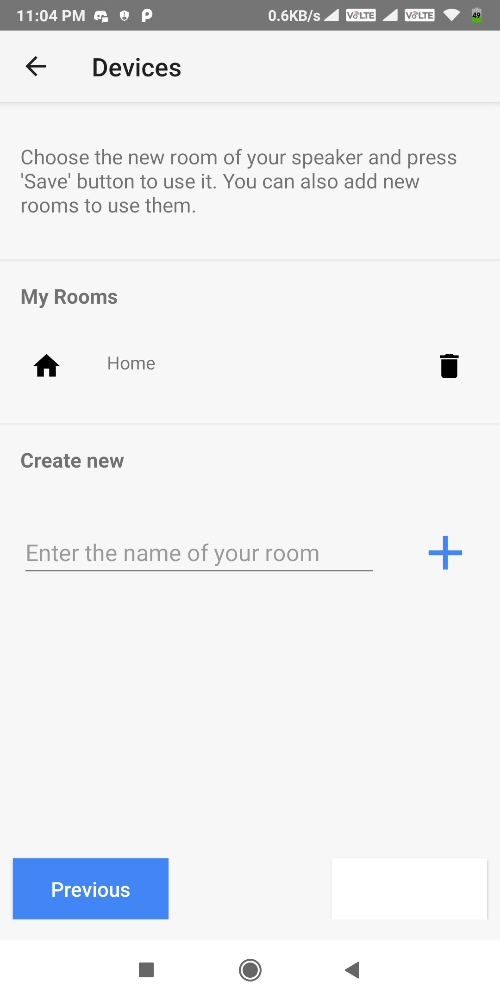
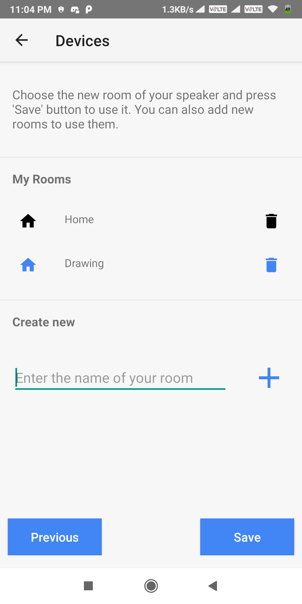
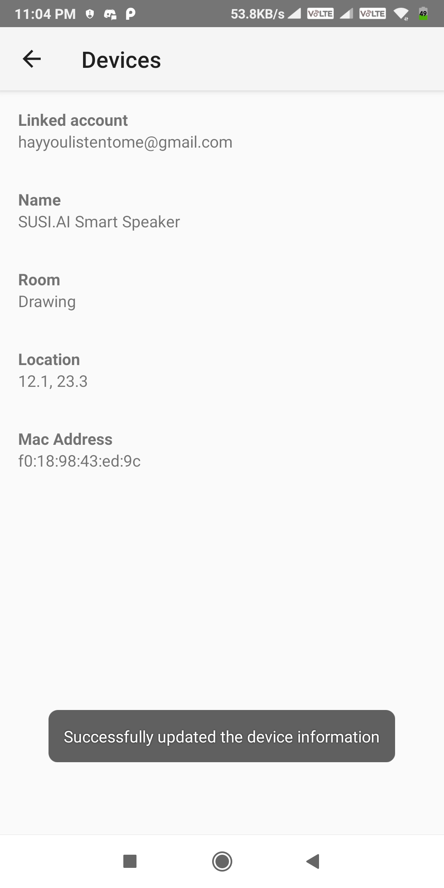

# Smart Speaker Details Editing

Make sure you have configured your device in non anonymous mode. If you have configured your device in anonymous mode then you will not be able to edit the details.

This guide is for updating details of the susi smart speakers you have configured using the SUSI.AI android app.

## Updating the device details using the Android app.

* Download the Android app either from the [playstore](https://play.google.com/store/apps/details?id=ai.susi) or from [Github](https://github.com/fossasia/susi_android/tree/apk).

* Open up the android app to see a screen like this. Login to your account or register a new one as per your need.

   

* After logging in you'll see the main screen of the app. click on the blue circle icon with SUSI logo on it.

   

* Now You'll see the SUSI skills page, click on the three dots on tthe top right corner of the screen and select settings.

   

* Scroll down to the devices section. And click on `Connected devices`.

   
  
* You will now see the list of the connected devices. Click on the device whose configuration you want to edit.
  
   
  
* Information stored related to the device appears in the screen. You can now edit the data like "Name", "Room", etc.

     
  
* To edit the name of the speaker click on the view that shows the name of your speaker. Now write the new name and press "Save" button. To cancel press "Cancel" button.

    <table>
      <tr>
        <td></td>
        <td></td>
      </tr>
    </table> 
    
* To change the room, click on the view that shows the room name. Now, in the layout that appears, you can add new room or select from the already present list. 
Once selected, press the "Save" button to update it or "Cancel" button to cancel the selection of room.

    <table>
      <tr>
        <td></td>
        <td></td>
        <td></td>
      </tr>
    </table> 
  